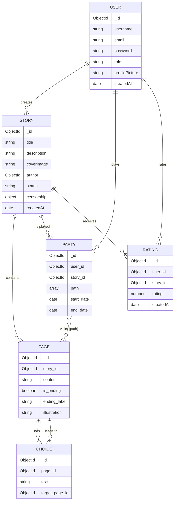

# 📚 NAHB - Not Another Hero's Book

<div align="center">


**Une plateforme web de création et lecture d'histoires interactives**  
*"Livre dont vous êtes le héros" version numérique*

[🚀 Démo](#-démo) • [📖 Documentation](#-fonctionnalités) • [🛠️ Installation](#️-installation) • [🐳 Docker](#-docker)

</div>

---

## 📋 Table des matières

- [Présentation](#-présentation)
- [Fonctionnalités](#-fonctionnalités)
- [Stack Technique](#-stack-technique)
- [Architecture](#-architecture)
- [Installation](#️-installation)
- [Docker](#-docker)
- [API Documentation](#-api-documentation)
- [Captures d'écran](#-captures-décran)
- [Équipe](#-équipe)

---

## 🎯 Présentation

**NAHB** (Not Another Hero's Book) est une application web fullstack permettant de :

- **Créer** des histoires interactives avec des embranchements narratifs
- **Jouer** ces histoires en faisant des choix qui impactent la fin
- **Gérer** le contenu via un panneau d'administration

Un même utilisateur peut être à la fois **auteur** et **lecteur**.

### 🎭 Les Rôles

| Rôle | Description |
|------|-------------|
| **Lecteur** | Parcourt les histoires, fait des choix, atteint différentes fins |
| **Auteur** | Crée et édite des histoires interactives |
| **Admin** | Modère le contenu, accède aux statistiques globales |

---

## ✨ Fonctionnalités

### 🔐 Authentification
- ✅ Inscription (email + mot de passe)
- ✅ Connexion / Déconnexion
- ✅ Gestion de session JWT
- ✅ Rôles utilisateur (user, creator, admin)

### ✍️ Côté Auteur
- ✅ Créer une histoire (titre, description, image de couverture)
- ✅ Éditeur de pages avec contenu narratif
- ✅ Gestion des choix (liens entre pages)
- ✅ Visualisation arborescente de l'histoire
- ✅ Mode brouillon / publié
- ✅ Modification du titre, description et image
- ✅ Statistiques de lecture

### 📖 Côté Lecteur
- ✅ Liste des histoires publiées avec recherche
- ✅ Lecture interactive avec navigation par choix
- ✅ Pages de fin identifiées
- ✅ Sauvegarde automatique de la progression
- ✅ Reprise de lecture
- ✅ Système de notation (1-5 ★)
- ✅ Collection des fins débloquées

### 🛡️ Côté Admin
- ✅ Panneau d'administration dédié
- ✅ Censure/bannissement d'histoires
- ✅ Vue globale de toutes les histoires
- ✅ Statistiques de la plateforme

---

## 🛠️ Stack Technique

### Frontend
| Technologie | Version | Description |
|-------------|---------|-------------|
| Next.js | 16.0.4 | Framework React avec App Router |
| React | 19.2.0 | Bibliothèque UI |
| TailwindCSS | 4.x | Framework CSS utilitaire |
| TypeScript | 5.x | Typage statique |

### Backend
| Technologie | Version | Description |
|-------------|---------|-------------|
| Node.js | 20.x | Runtime JavaScript |
| Express | 5.1.0 | Framework web |
| MongoDB | - | Base de données NoSQL |
| Mongoose | 9.0.0 | ODM pour MongoDB |
| JWT | 9.0.2 | Authentification |

### DevOps
| Technologie | Description |
|-------------|-------------|
| Docker | Conteneurisation |
| Swagger | Documentation API |

---

## 🏗️ Architecture

### Structure du projet

```
clone_project/
├── client/                    # Frontend Next.js
│   └── heros-faith/
│       ├── src/
│       │   ├── api/          # Clients API
│       │   ├── app/          # Pages (App Router)
│       │   ├── components/   # Composants React
│       │   ├── hooks/        # Hooks personnalisés
│       │   └── styles/       # Styles globaux
│       └── package.json
│
├── server/                    # Backend Express
│   └── src/
│       ├── config/           # Configuration BDD
│       ├── controllers/      # Logique métier
│       ├── middlewares/      # Auth, erreurs, upload
│       ├── models/           # Schémas Mongoose
│       ├── routes/           # Routes API
│       └── server.ts         # Point d'entrée
│
├── docs/                      # Documentation
├── Dockerfile                 # Build Docker
├── package.json              # Scripts racine
└── README.md
```

### Schéma de Base de Données



---

## 🚀 Installation

### Prérequis

- Node.js >= 20.0.0
- npm >= 10.0.0
- MongoDB (local ou Atlas)

### 1. Cloner le repository

```bash
git clone https://github.com/SeaFlyCode/Heros-faith.git
cd Heros-faith
```

### 2. Configuration des variables d'environnement

```bash
# Copier le fichier d'exemple
cp .env.example .env

# Éditer avec vos valeurs
nano .env
```

**Variables requises :**

```env
# MongoDB
MONGODB_URI=mongodb://localhost:27017/heros-faith

# JWT
JWT_SECRET=votre-secret-jwt-tres-securise

# Ports
PORT=3000
NEXT_PUBLIC_API_URL=http://localhost:3000/api

# Environnement
NODE_ENV=development
```

### 3. Installation des dépendances

```bash
# Installer toutes les dépendances (racine + client + server)
npm run install:all
```

### 4. Lancement en développement

```bash
# Lancer client ET serveur simultanément
npm run dev

# OU séparément :
npm run dev:server  # Backend sur http://localhost:3000
npm run dev:client  # Frontend sur http://localhost:3001
```

### 5. Build de production

```bash
# Build complet
npm run build:all

# Lancer en production
npm start
```

---

## 🐳 Docker

### Build et lancement

```bash
# Construire l'image
npm run docker:build

# Lancer le conteneur
npm run docker:run

# Voir les logs
npm run docker:logs

# Arrêter
npm run docker:stop
```

### Commande complète

```bash
# Build + Run en une commande
npm run docker:start

# Redémarrer
npm run docker:restart
```

### Ports exposés

| Service | Port |
|---------|------|
| Backend API | 3000 |
| Frontend | 3001 |

---

## 📡 API Documentation

L'API REST est documentée avec **Swagger**.

Accès : `http://localhost:3000/api-docs`

### Endpoints principaux

| Méthode | Endpoint | Description |
|---------|----------|-------------|
| **Auth** | | |
| POST | `/api/users/register` | Inscription |
| POST | `/api/users/login` | Connexion |
| GET | `/api/users/me` | Profil utilisateur |
| **Stories** | | |
| GET | `/api/stories` | Liste des histoires publiées |
| POST | `/api/stories` | Créer une histoire |
| GET | `/api/stories/:id` | Détails d'une histoire |
| PATCH | `/api/stories/:id` | Modifier une histoire |
| DELETE | `/api/stories/:id` | Supprimer une histoire |
| **Pages** | | |
| GET | `/api/pages/story/:storyId` | Pages d'une histoire |
| POST | `/api/pages` | Créer une page |
| **Choices** | | |
| GET | `/api/choices/page/:pageId` | Choix d'une page |
| POST | `/api/choices` | Créer un choix |
| **Parties** | | |
| POST | `/api/parties` | Créer une partie |
| PATCH | `/api/parties/:id` | Mettre à jour progression |
| **Ratings** | | |
| POST | `/api/ratings` | Noter une histoire |
| GET | `/api/ratings/story/:storyId/average` | Moyenne d'une histoire |

---

## 📸 Captures d'écran

### Page d'accueil
*Interface d'accueil avec effet Prism animé*

### Éditeur d'histoire
*Création de pages et choix avec visualisation arborescente*

### Lecture d'histoire
*Interface de lecture immersive avec choix interactifs*

### Panel Admin
*Gestion et modération des histoires*

---

## 🎨 Maquettes

### User Flow

```
┌─────────────┐     ┌─────────────┐     ┌─────────────┐
│   Accueil   │────▶│  Connexion  │────▶│   Profil    │
└─────────────┘     └─────────────┘     └─────────────┘
       │                                       │
       ▼                                       ▼
┌─────────────┐                         ┌─────────────┐
│    Lire     │                         │   Écrire    │
│  histoires  │                         │  histoires  │
└─────────────┘                         └─────────────┘
       │                                       │
       ▼                                       ▼
┌─────────────┐                         ┌─────────────┐
│   Jouer     │                         │   Éditeur   │
│   partie    │                         │    arbre    │
└─────────────┘                         └─────────────┘
       │
       ▼
┌─────────────┐
│    Fin +    │
│   Notation  │
└─────────────┘
```

---

## 👥 Équipe

| Membre | Rôle |
|--------|------|
| **Sami** | Développeur Fullstack |
| **Mathéo** | Développeur Fullstack |

---

## 📄 Licence

Ce projet est sous licence ISC.

---

## 🔗 Liens

- **Repository** : [GitHub](https://github.com/SeaFlyCode/Heros-faith)
- **Issues** : [GitHub Issues](https://github.com/SeaFlyCode/Heros-faith/issues)

---

### ✅ Tâches Complétées

- [x] **Bouton de signalement** (Sami)
  - Ajout d'un bouton "Signaler" dans la page de lecture d'histoire
  - Modal avec raisons prédéfinies pour le signalement
  - Section admin pour gérer les signalements

### 🔄 Tâches En Cours

- [ ] **Ajouter une preview** (Sami)
  - Prévisualisation des histoires avant publication

- [ ] **Refactoring Backend - Architecture Services** (Mathéo)
  - Déplacer les fonctions des controllers vers des services
  - Meilleure séparation des responsabilités

- [ ] **Supprimer une histoire** (Mathéo)
  - Permettre aux auteurs de supprimer leurs histoires
  - Gestion des dépendances (pages, choix, parties)

- [ ] **Supprimer un utilisateur (Admin)** (Mathéo)
  - Fonctionnalité admin pour supprimer un utilisateur
  - Suppression en cascade de toutes ses données (histoires, parties, ratings, etc.)

- [ ] **Refaire le déploiement**
  - Mise à jour de la configuration de déploiement
  - Déploiement sur l'environnement de production

---


<div align="center">

**Made with ❤️ for SDV**

*Projet réalisé dans le cadre de la formation - Novembre 2025*

</div>
