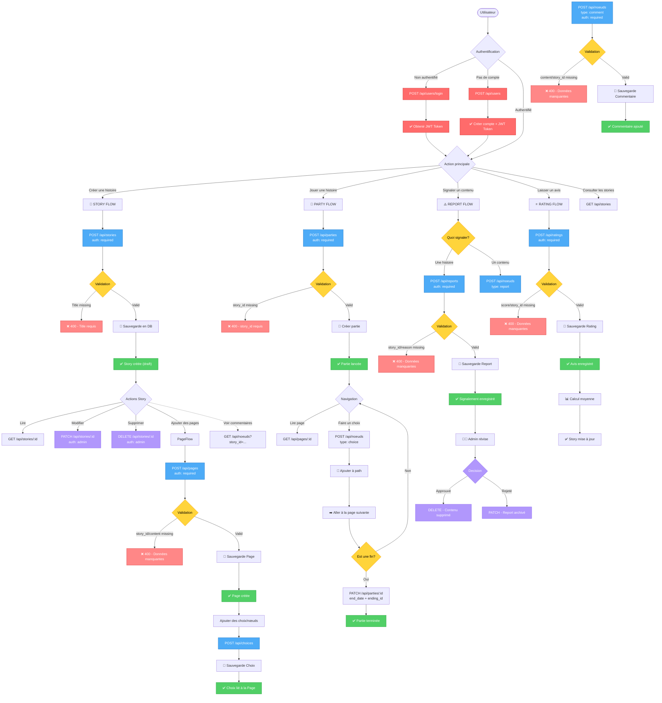
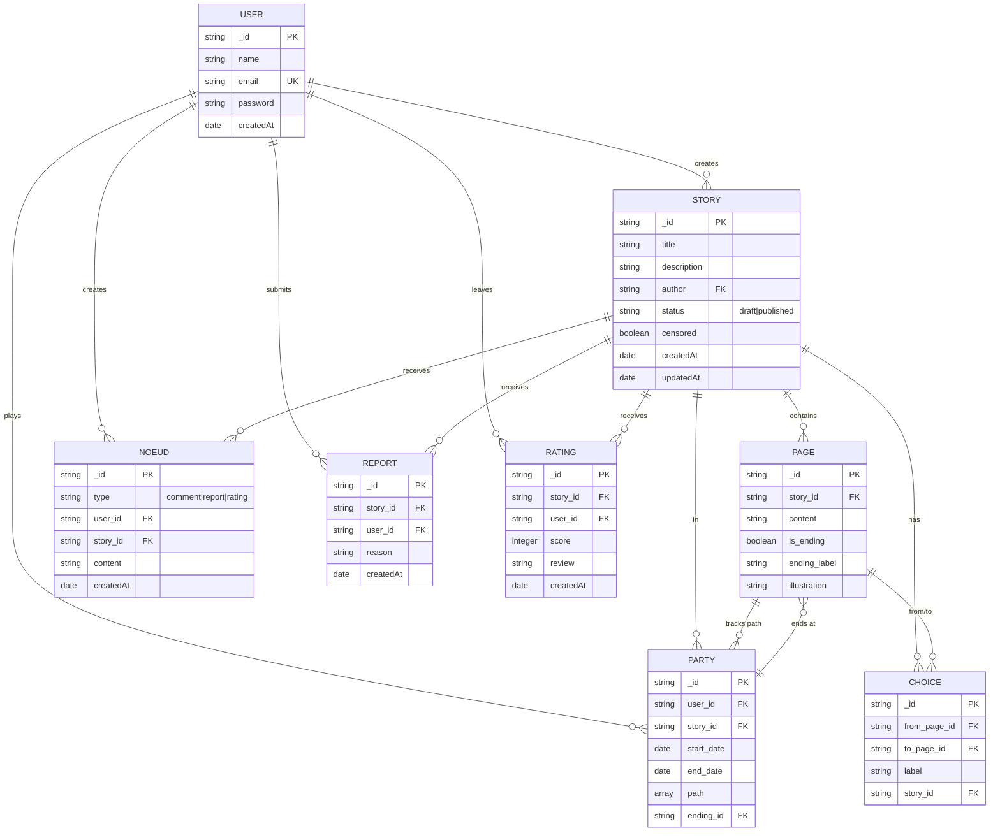
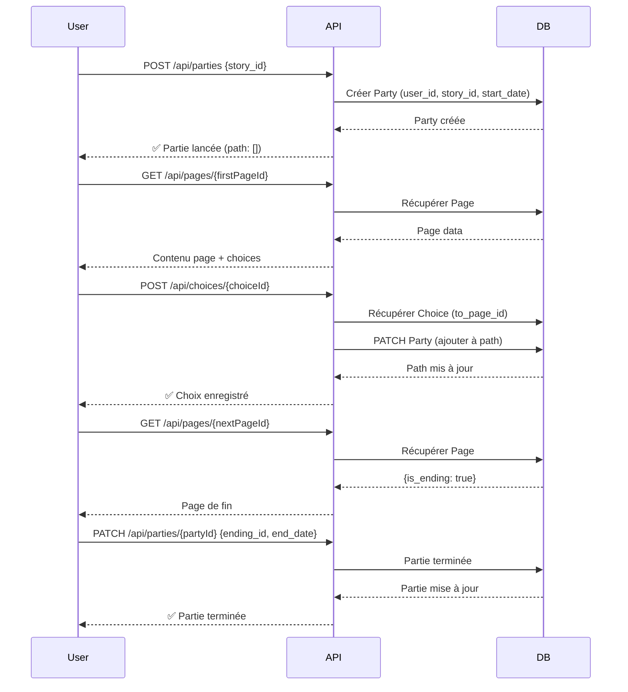

# 🎮 Workflow Backend - Heros Faith

## Diagramme complet du système



---

## 📊 Modèle de données relationnel



---

## 🔐 Matrice d'authentification & autorisation

| Endpoint | Méthode | Auth | Rôle | Description |
|----------|---------|------|------|-------------|
| `/users` | POST | ❌ | - | Créer un compte |
| `/users/login` | POST | ❌ | - | Se connecter |
| `/users` | GET | ✅ | admin | Lister tous les utilisateurs |
| `/users/:id` | GET | ✅ | - | Voir un utilisateur |
| `/stories` | POST | ✅ | - | Créer une story |
| `/stories` | GET | ❌ | - | Lister toutes les stories |
| `/stories/:id` | GET | ❌ | - | Voir une story |
| `/stories/:id` | PATCH | ✅ | admin | Modifier une story |
| `/stories/:id` | DELETE | ✅ | admin | Supprimer une story |
| `/pages` | POST | ✅ | - | Créer une page |
| `/pages/:id` | GET | ❌ | - | Voir une page |
| `/pages/:id` | PATCH | ✅ | - | Modifier une page |
| `/choices` | POST | ✅ | - | Créer un choix |
| `/noeuds` | POST | ✅ | - | Créer un nœud (comment/report/rating) |
| `/parties` | POST | ✅ | - | Créer une partie |
| `/parties/:id` | GET | ✅ | - | Voir une partie |
| `/parties/:id` | PATCH | ✅ | - | Mettre à jour une partie |
| `/reports` | POST | ✅ | - | Créer un signalement |
| `/reports` | GET | ✅ | admin | Voir tous les signalements |
| `/ratings` | POST | ✅ | - | Laisser un avis |

---

## 🎯 Cas d'usage principaux

### 1️⃣ Créer et publier une histoire
```
1. Créer Story (title, description)
2. Créer Pages (contenu, fin?)
3. Créer Choices (relier pages)
4. Mettre en draft/published
5. Les utilisateurs peuvent jouer
```

### 2️⃣ Jouer une histoire
```
1. Créer Party (user_id, story_id)
2. Naviguer Pages via Choices
3. Chaque choix ajoute à path
4. Terminer Party quand ending atteint
```

### 3️⃣ Commenter une story
```
1. Créer Noeud (type: comment)
2. Contient: user_id, story_id, content
3. Visible pour tous
```

### 4️⃣ Signaler un contenu
```
1. Créer Report (story_id, user_id, reason)
2. Admin révise
3. Admin supprime ou archive
```

### 5️⃣ Laisser un avis
```
1. Créer Rating (story_id, user_id, score)
2. Moyenne calculée
3. Affichée sur la story
```

---

## 🚀 Flux complet d'une partie




